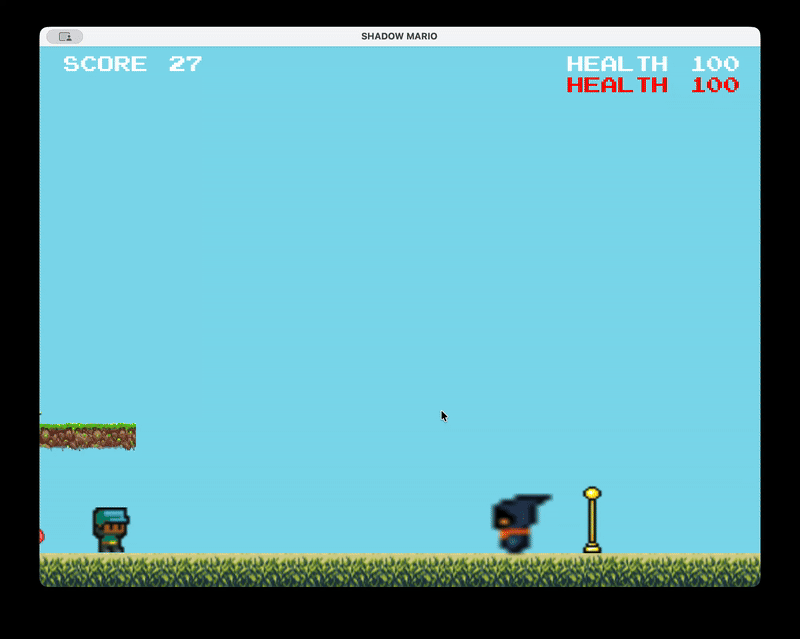

# Shadow Mario: 2D Java Platformer Engine


> A feature-rich 2D platformer game showcasing **Object-Oriented Design** principles. Built from scratch (logic layer) on top of the Bagel educational framework.

<table>
  <tr>
    <td width="33%">
      
      <p><em>Level 1: Basic platform mechanics</em></p>
    </td>
    <td width="33%">
      
      <p><em>Level 2: Flying platforms & power-ups</em></p>
    </td>
    <td width="33%">
      
      <p><em>Level 3: Boss fight with projectiles</em></p>
    </td>
  </tr>
</table>

## Game Features

This project implements core mechanics found in classic platformers, handling complex entity interactions and state management:

* **Physics System:** Custom gravity simulation, jumping mechanics (variable height), and momentum.
* **Dynamic Entities:**
    * **Flying Platforms:** Moving terrain that carries the player.
    * **Power-ups:** Temporary state modifiers (Invincibility & Double Score) implemented via status flags.
* **Combat System:**
    * **Projectile Logic:** Fireball generation, trajectory calculation, and boundary checks.
    * **Boss AI:** A scripted enemy boss with health states and randomized attack patterns.
* **Level Parsing:** Dynamic level loading from CSV configuration files.

## Technical Implementation (OOD)

The core strength of this project lies in its strict adherence to **Object-Oriented Software Development (OOSD)** principles:

### 1. Polymorphism & Inheritance Hierarchy

Designed a scalable entity system to manage diverse game objects without code duplication.

```
GameEntity (Abstract)
├── Character (Abstract)
│   ├── Player
│   ├── Enemy
│   └── EnemyBoss
└── NonCharacter (Abstract)
    ├── CollisionEntity (Abstract)
    │   ├── Coin
    │   ├── Fireball
    │   ├── EndFlag
    │   └── PowerUP
    ├── Platform
    └── FlyingPlatform
```

**Key Design Patterns:**
- **Inheritance:** Common behaviors (position, rendering, collision) are abstracted into base classes.
- **Polymorphism:** All entities implement `update(Input input)` method, allowing unified game loop processing.
- **Encapsulation:** Entity states (health, position, speed) are protected within their respective classes.

**Polymorphism in Action - Unified Game Loop:**

The game loop leverages polymorphism to process all entities uniformly, regardless of their concrete type. Each entity (Player, Enemy, Coin, Fireball, etc.) implements the abstract `update(Input input)` method, allowing the game to treat them as `GameEntity` instances:

```java
// Simplified game loop demonstrating polymorphism
public void updateLevel(Input input) {
    // All entities share the same interface
    player.update(input);
    platform.update(input);
    endFlag.update(input);
    
    // Collections of entities processed uniformly
    for (Coin coin : COINS_LIST) {
        coin.update(input);  // Polymorphic call
        coin.draw();         // Each entity knows how to render itself
    }
    
    for (Enemy enemy : ENEMY_LIST) {
        enemy.update(input); // Different behavior, same interface
        enemy.draw();
    }
    
    for (Fireball fireball : FIREBALL_LIST) {
        fireball.update(input); // Fireball has its own update logic
        fireball.draw();
    }
    
    // Each entity type implements update() differently:
    // - Player: handles input, gravity, jumping
    // - Enemy: AI movement patterns
    // - Fireball: projectile physics
    // - Platform: scrolling behavior
}
```

This design eliminates the need for type-specific conditional logic, making the codebase more maintainable and extensible. Adding new entity types requires no changes to the game loop—they simply implement the `GameEntity` interface.

### 2. Collision Detection System

Implemented **AABB (Axis-Aligned Bounding Box)** collision logic to handle interactions between dynamic entities (Player) and the environment.

**Strategy:** Separation of collision logic allows different behaviors:
- Player vs Coin → triggers collection
- Player vs Enemy → triggers damage
- Player vs Fireball → triggers damage (boss fireballs) or nullifies (player fireballs)
- Player vs EndFlag → triggers level completion

**Implementation:**
```java
public boolean checkCollision(Character character) {
    double collisionRange = RADIUS + character.getRADIUS();
    double distance = super.getPosition().distanceTo(character.getPosition());
    return distance <= collisionRange;
}
```

### 3. File I/O & Configuration

**Level Loader:** Parses world CSV files to instantiate entities dynamically at runtime using the Factory pattern concept.

**Properties Manager:** Manages game constants (gravity, speed, health) via external `.properties` files for easy tuning without recompilation.

**Configuration Files:**
- `res/app.properties` - Game constants and asset paths
- `res/message_en.properties` - UI text localization
- `res/level1.csv`, `res/level2.csv`, `res/level3.csv` - Level layouts

### 4. State Management

**Singleton Pattern:** `LevelManager` ensures a single source of truth for game state:
- Player status (health, score, power-ups)
- Entity collections (enemies, coins, fireballs)
- Game progression (current level, win/loss conditions)

**Status Flags:** Power-ups use boolean flags with frame-based timers:
- `invincible` - Temporary damage immunity
- `doubleScore` - Score multiplier effect

## How to Run

### Prerequisites
- **Java Development Kit (JDK) 11 or higher**
- **Maven** (for dependency management)
- **IntelliJ IDEA** or **Eclipse** (recommended IDE)

### Setup Instructions

1. **Clone the repository:**
```bash
git clone https://github.com/[YourUsername]/java-2d-platformer.git
cd java-2d-platformer
```

2. **Build the project:**
```bash
mvn clean compile
```

3. **Run the game:**
   - **IntelliJ IDEA:** Right-click `ShadowMario.java` → Run 'ShadowMario.main()'
   - **Eclipse:** Right-click `ShadowMario.java` → Run As → Java Application
   - **Command Line:**
```bash
mvn exec:java -Dexec.mainClass="ShadowMario"
```

### Game Controls

- **Arrow Keys (Left/Right):** Move player
- **Space:** Jump
- **S:** Shoot fireball (Level 3 only)
- **1/2/3:** Select level (at start screen)
- **Escape:** Exit game
- **Space:** Restart (after game over/win)

## Project Structure

```
java-2d-platformer/
├── src/
│   ├── ShadowMario.java          # Main game class
│   ├── LevelManager.java          # Level state management (Singleton)
│   ├── GameEntity.java            # Abstract base class
│   ├── Character.java             # Abstract character class
│   ├── Player.java                # Player implementation
│   ├── Enemy.java                 # Basic enemy AI
│   ├── EnemyBoss.java             # Boss enemy with activation radius
│   ├── Fireball.java              # Projectile system
│   ├── FireballConfig.java        # Fireball configuration loader
│   ├── CollisionEntity.java       # Collision-enabled entities
│   ├── NonCharacter.java          # Non-character base class
│   ├── Platform.java              # Static platform
│   ├── FlyingPlatform.java        # Moving platform
│   ├── Coin.java                  # Collectible items
│   ├── PowerUP.java               # Power-up items
│   ├── EndFlag.java               # Level completion trigger
│   ├── TextElement.java           # UI text rendering
│   ├── IOUtils.java               # File I/O utilities
│   └── RandomUtils.java           # Random number generation
├── res/
│   ├── app.properties             # Game configuration
│   ├── message_en.properties      # Localized strings
│   ├── level1.csv                # Level 1 layout
│   ├── level2.csv                 # Level 2 layout
│   ├── level3.csv                 # Level 3 layout
│   └── [asset files]              # Images, fonts, etc.
├── pom.xml                        # Maven configuration
└── README.md                      # This file
```

## Level Progression

- **Level 1:** Basic platforming with enemies and coins
- **Level 2:** Introduces flying platforms and power-ups (Double Score, Invincibility)
- **Level 3:** Boss fight with fireball combat mechanics

## Credits & Disclaimer

- **Engine:** Built using the **Bagel (Basic Academic Game Engine Library)** provided by the University of Melbourne.
- **Assets:** Game sprites and fonts provided by course resources.
- **Scope:** While the engine handles basic rendering loop, all gameplay logic (Physics, AI, Collision, Game States) was implemented as part of the **SWEN20003** coursework.

## License

This project is part of academic coursework and is intended for educational purposes.

---

**Author:** QILIN  
**Course:** SWEN20003 - Object-Oriented Software Development  
**Institution:** University of Melbourne
